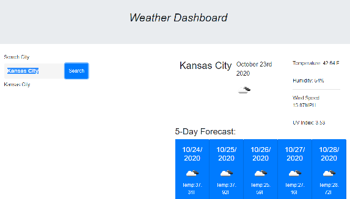

# Weather Dashboard
___________________________________________
Are you planning a vacation? Or wanting to schedule a special date? Or maybe planning a visit to grandma's house? Here, you will be able to enter the city of your location/destination and view the current weather and plan according to the next 5 days.
___________________________________________
Website: https://kjhallam.github.io/06_weather_dashboard/

GitHub: https://github.com/kjhallam/06_weather_dashboard.git
___________________________________________
## Criteria 

- WHEN I search for a city
- THEN I am presented with current and future conditions for that city and that city is added to the search history

- WHEN I view current weather conditions for that city

- THEN I am presented with the city name, the date, an icon representation of weather conditions, the temperature, the humidity, the wind speed, and the UV index

- Viewing the UV index I am presented with a color that indicates whether the conditions are favorable, moderate, or severe

- WHEN I view future weather conditions for that city
- THEN I am presented with a 5-day forecast that displays the date, an icon representation of weather conditions, the temperature, and the humidity
- WHEN I click on a city in the search history
- THEN I am again presented with current and future conditions for that city
- WHEN I open the weather dashboard
- THEN I am presented with the last searched city forecast.

_______________________________________________________________________
Issues (Project 6 Weather Dashboard)
_______________________________________________________________________
Faced many trials with rendering a weather dashboard that was displaying the 5 day Forecast.

_______________________________________________________________________
Image:
